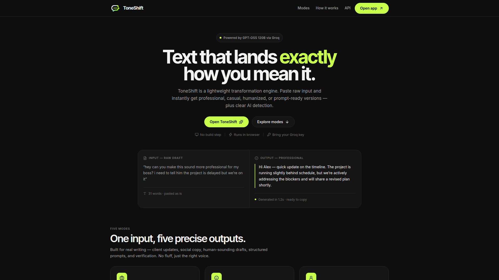
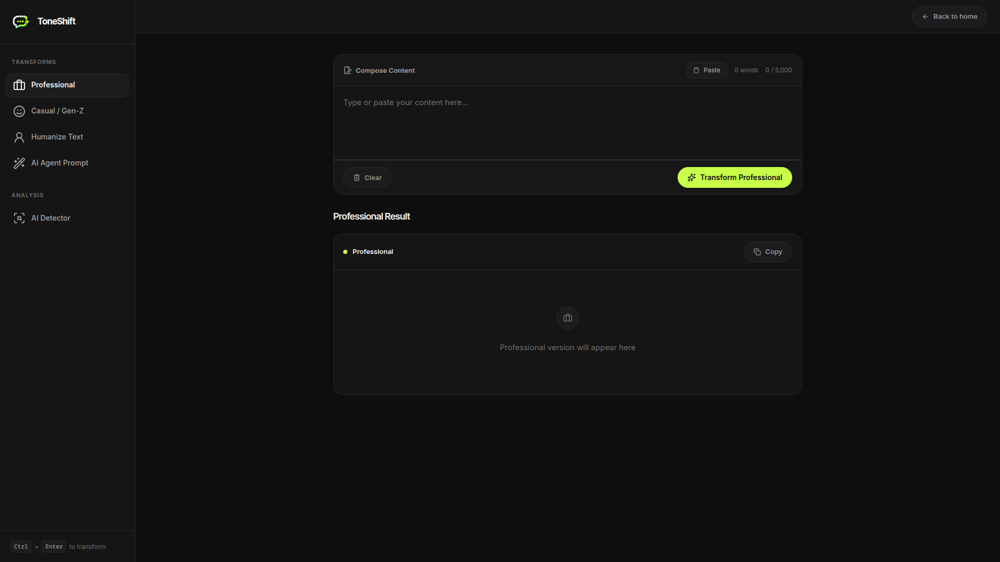

# ToneShift

ToneShift is a lightweight, AI-driven text transformation engine. It processes raw input and instantly restructures it into specific stylistic formats — whether you need business-ready polish, authentic conversational pacing, or structured prompts for other AI agents.

**Live Demo:** https://toneshift-app.vercel.app

## Screenshots

<p align="center">
  
</p>
<p align="center">
  
</p>

## Capabilities

ToneShift uses **GPT-OSS 120B (via Groq)** to analyze and rewrite text across five distinct modes:

| Mode | Description |
| :--- | :--- |
| **Professional** | Transform text into polished, business-ready writing suitable for executives, clients, and formal documents. Clear, concise, and credible. |
| **Casual / Gen-Z** | Convert text into natural, friendly conversation that sounds like a real person wrote it — without losing meaning. |
| **Humanize** | Remove AI-sounding patterns, vary sentence rhythm, and make text sound authentically human-written to bypass detection. |
| **AI Agent Prompt** | Turn a rough idea into a detailed, professional AI prompt that gets better results from any agent. |
| **AI Detector** | Analyze any text to estimate whether it was written by a human or AI, with confidence scoring. |

## Quick Start

ToneShift requires a free [Groq API key](https://console.groq.com/keys) for model inference.

### Local Development (Zero Setup)

No build step — runs entirely in the browser.

1. Clone the repository:
   ```bash
   git clone https://github.com/aluukill/ToneShift.git
   cd ToneShift
   ```
2. Duplicate `.env.example` and rename it to `.env.local`
3. Add your Groq API key:
   ```
   GROQ_API_KEY=your_groq_api_key_here
   ```
4. Open `toneshift.html` directly in your browser.

Or open `index.html` for the landing page and click **Open app**.

### Vercel Deployment (Recommended)

For production use, the backend is optimized for Vercel Serverless Functions.

1. Install the Vercel CLI:
   ```bash
   npm i -g vercel
   ```
2. Authenticate:
   ```bash
   vercel login
   ```
3. Deploy the project:
   ```bash
   vercel
   ```
4. In your **Vercel Project Settings → Environment Variables**, add:
   ```
   GROQ_API_KEY = your_groq_api_key_here
   ```

## How to Use ToneShift

1. **Enter your text** in the input box (up to 5,000 characters)
2. **Select a transformation mode** from the sidebar (Professional, Casual / Gen-Z, Humanize, AI Agent Prompt, AI Detector)
3. **Click Transform** to generate the converted text
4. **Copy the result** with a single click

Keyboard shortcut: `Ctrl + Enter` (or `Cmd + Enter` on Mac) to transform.

## Understanding the Modes

### Professional
Use for executives, clients, formal documents, and job applications. Removes casual language, adds clarity, and uses business-appropriate vocabulary.

### Casual / Gen-Z
Use for social media, messages, and blog posts. Adds natural flow and friendly engagement while keeping grammar clean.

### Humanize
Use when text sounds too robotic or to bypass AI detection. Varies sentence length, removes formulaic patterns, and adds authentic voice.

### AI Agent Prompt
Use when you have a vague idea but need a detailed prompt for ChatGPT or other tools. Expands it into a structured prompt with role, context, requirements, and output format.

### AI Detector
Use to verify if content is AI-generated. Analyzes patterns and provides a probability score with confidence.

## Architecture

ToneShift is built with a minimalist, dependency-light stack:

- **Frontend:** Vanilla HTML/CSS/JavaScript (clean, dark-mode-ready UI) — `index.html`, `toneshift.html`
- **Backend:** Node.js (Vercel Serverless Function) — `api/transform.js`
- **Inference:** GPT-OSS 120B powered by Groq's high-speed API
- **Deployment:** Vercel (Serverless)

No framework tax. No build step required for local development.

## API Reference

ToneShift's transformation logic can be consumed by external applications via its serverless endpoint.

**Endpoint:** `POST /api/transform`

**Request Body:**

```json
{
  "text": "String to be transformed",
  "tone": "professional | casual | humanize | prompt | detector"
}
```

**Response (Success):**

```json
{
  "success": true,
  "text": "Transformed text here"
}
```

**Response (Missing Context for prompt mode):**

```json
{
  "success": false,
  "type": "missing_context",
  "message": "More information required",
  "details": "INSUFFICIENT_CONTEXT\n\nMissing required elements:\n- ..."
}
```

Headers: `Content-Type: application/json` — CORS ready.

## Troubleshooting

### "Server configuration error"
Your Groq API key is not set correctly. Make sure:
- The `.env.local` file exists (for local development)
- The environment variable `GROQ_API_KEY` is set in Vercel (for deployed version)

### "Text exceeds maximum length"
Input is too long. ToneShift accepts up to 5,000 characters.

### "AI request failed"
Temporary issue with the Groq service. Try again in a few moments.

## Contributing

Contributions are welcome. Please feel free to submit issues or pull requests.

## License

This project is available for personal and commercial use.

## Support

If you encounter issues:

1. Check that your API key is valid and has not expired
2. Verify you have an active internet connection
3. Try refreshing the page and attempting the operation again
